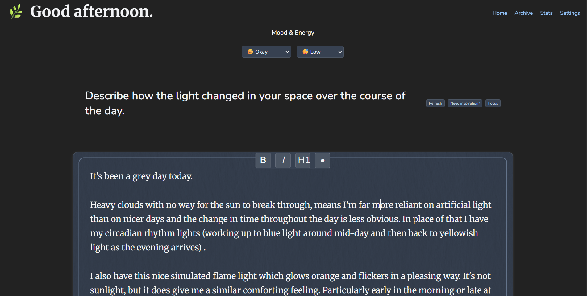
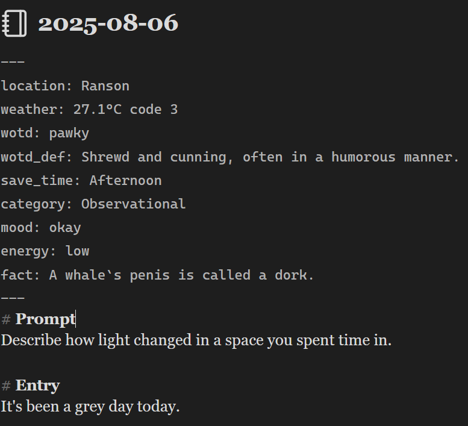
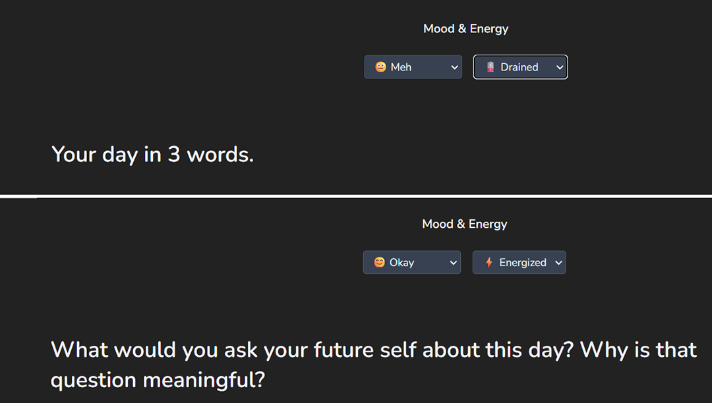
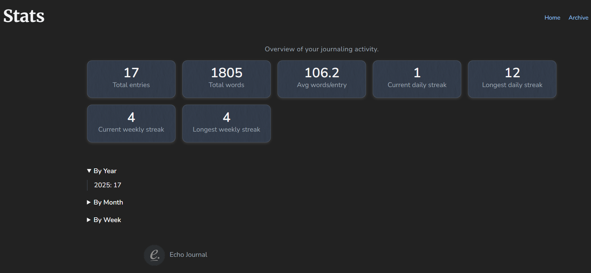
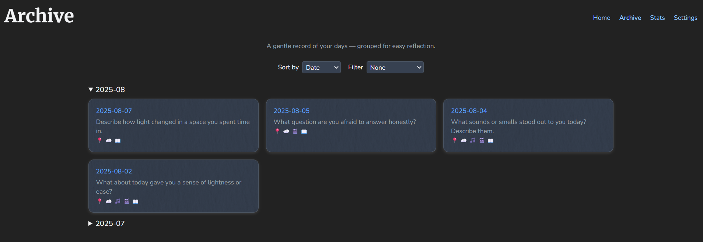
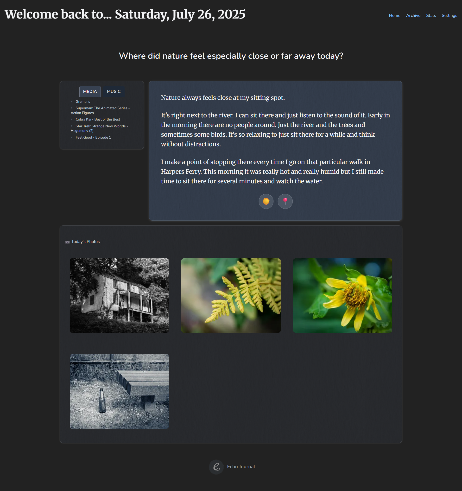

# Echo Journal

> **A low-friction, neurodivergent-friendly journaling app that stores your words in timeless Markdown and adapts to your mood and energy.**  

## Why I Built Echo Journal

I’ve tried and bounced off journaling apps for years. Some felt overwhelming. Others felt like a chore, too cluttered, too demanding, too rigid. The list of reasons they didn’t work for me goes on and on. Inevitably, I’d stop using them and never go back.

I needed something frictionless. Something that encouraged me to write without guilt, and helped anchor me in the day I was living. So I built my own.

Echo Journal provides prompts that adapt to my energy and mood. It gets out of the way and just lets me write when I feel like it. It saves everything in Markdown, so my raw text is always accessible no matter what happens. It's stored locally, with no privacy compromises. And by pulling in gentle context like weather, location, music, media, and photos, each entry becomes a personal time capsule for that day.

Echo Journal is a minimalist FastAPI journaling app designed for **AuADHD minds** and anyone who values simplicity, flexibility, and control over their own data.

- **Markdown at its core** — every entry is a plain `.md` file you can read, edit, and back up forever.  
- **Adaptive prompts** — adjusts to your current mood and energy to make journaling possible even on low-bandwidth days.  
- **Ultra-low friction** — open → type → save. No clutter, no pressure.  
- **Optional enrichment** — mood, energy, location, weather, photos, media — all if you want, none if you don’t.

[](LICENSE) [](https://github.com/EoghannIrving/echo_journal/actions/workflows/pytest.yml)    [](#about-the-development)

## Table of Contents

- [Features](#features)
- [How It Looks](#how-it-looks)
- [Prerequisites](#prerequisites)
- [Installation](#installation)
- [Usage](#usage)
- [Configuration](#configuration) ([details](docs/configuration.md))
- [Example walkthrough](#example-walkthrough)
- [API reference](#api-reference)
- [CLI commands](#cli-commands)
- [Roadmap](#roadmap)
- [Design Guardrails](#design-guardrails)
- [YAML Frontmatter Reference](#yaml-frontmatter-reference)
- [Deployment](#deployment)
- [Testing](#testing)
- [Alpha Feedback](#alpha-feedback)
- [Bugs and Issues](#bugs-and-issues)
- [Contributing](#contributing)
- [About the Development](#about-the-development)
- [License](#license)

## Features

**📄 Markdown-first journaling**  
- Portable, human-readable `.md` files with optional YAML frontmatter.  
- Compatible with Obsidian, VS Code, or any text editor.
- They are your thoughts and memories, take them anywhere.  

**🧠 Adapts to your mood and energy**  
- Daily prompts that scale to your current bandwidth because sometimes you just.. *can't*.
- Micro prompts for those bad days. (Write a word, type an emjoi).
- AI helper to refresh or create new prompts instantly.  

**♾️ AuADHD-friendly design**  
- One-action journaling: open → tag mood → write → save.
- Prompts designed to encourage writing without pressuring.
- Optional auto-enrichment (location, weather, media, photos, trivia).  
- Stats and archive views for gentle pattern tracking.  

**🔌 Optional integrations**  
- **Wordnik** (word of the day), **Immich** (photos), **Jellyfin** (media history), **Useless Facts** (random fact).
- Per-browser toggles — nothing is forced, nothing runs you didn’t ask for.
- See your day in context.

**🔐 Local-first & private**  
- Runs on your machine or private server.  
- Optional HTTP Basic authentication for remote use.  

## How It Looks


*Just open, type, and save. No clutter. No guilt.*


*Entries are saved as portable Markdown files with optional frontmatter metadata.*


*Prompts shift to match your energy and mental bandwidth.*


*Tracks stats in a guilt-free way. You can continue a weekly streak even if you break your daily streak .*


*Archives allow you to revisit any day where you wrote a journal entry. Easily filter by meta-data.*


*Archive entry page centers on your journal but surrounds it with metadata to enrich the experience*

## Prerequisites

- **Python** 3.10+
- *(Optional)* **Node.js** 18+ and npm if you plan to modify Tailwind CSS. A prebuilt `static/tailwind.css` is included for immediate use.
- **Docker** and **Docker Compose** (optional, for containerized deployment). If the `docker compose` command is unavailable, install the [Docker Compose plugin](https://docs.docker.com/compose/install/).

## Installation

## Docker

Docker Compose offers the fastest way to get Echo Journal running, while the Python workflow is ideal for development or customization.

### Run with Docker Compose

> Note: The following commands use Docker Compose v2. If `docker compose` is unavailable, install the [Docker Compose plugin](https://docs.docker.com/compose/install/).

1. **Copy the example environment file and adjust settings as needed:**

   ```bash
   cp .env.example .env
   # edit .env to change HOST_PORT, DATA_DIR, or TLS paths
   ```

2. **Prepare a persistent journals directory (matches `DATA_DIR`, default `data`):**

   ```bash
   mkdir -p data
   ```

3. **Add the Settings.yaml**

   ```bash
   mkdir -p data/.settings
   cp .settings.example.yaml data/.settings/settings.yaml
   #edit .settings.yaml
   ```

4. **Start the container:**

   ```bash
   docker compose up -d
   ```

   Then open <http://localhost:8510> (or your chosen `HOST_PORT`) in your browser.

5. **Stop the container while preserving data:**

   ```bash
   docker compose down
   ```

   Journal files remain in the mounted `data` directory on the host.
   
### Automated Python setup

```bash
git clone https://github.com/EoghannIrving/echo_journal.git
cd echo_journal
./scripts/setup.sh
```

The `setup.sh` script creates a `.venv`, installs Python dependencies, runs `npm install`, and builds the Tailwind CSS bundle.

### Manual setup

```bash
git clone https://github.com/EoghannIrving/echo_journal.git
cd echo_journal
python -m venv .venv && source .venv/bin/activate
pip install .  # installs Echo Journal and its Python dependencies
```

The repository bundles a compiled `static/tailwind.css`, so Node.js and npm are only needed if you want to change styles. Running `npm install` will automatically rebuild the CSS via the `postinstall` script.

Python dependencies are defined in `pyproject.toml` and installed with `pip install .`.

### Run with Python

1. Create a virtual environment and install dependencies:

   ```bash
   python -m venv .venv && source .venv/bin/activate
   pip install .
   # npm install  # only needed if modifying Tailwind styles
   ```

2. Start the development server:

   ```bash
   uvicorn echo_journal.main:app --reload
   # or use the console script
   echo-journal
   ```

## Configuration

Echo Journal reads options from `<DATA_DIR>/.settings/settings.yaml` (default
`/journals/.settings/settings.yaml`). If the file is missing, environment
variables are used instead. Copy the example file to get started:

```bash
cp settings.example.yaml settings.yaml
# edit settings.yaml to set DATA_DIR, APP_DIR, and API keys
```

See [docs/configuration.md](docs/configuration.md) for a full list of
configuration values and defaults.

## Example walkthrough

To verify the app runs, try the following sequence:

```bash
git clone https://github.com/EoghannIrving/echo_journal.git
cd echo_journal
python -m venv .venv && source .venv/bin/activate
pip install .  # installs Echo Journal and its Python dependencies
uvicorn echo_journal.main:app --reload
# or
echo-journal
```

Then open <http://localhost:8510> in your browser. You should see the Echo Journal interface and can create a test entry.

## API reference

See [docs/API.md](docs/API.md) for a full list of available endpoints.

## CLI commands

`echo-journal` starts the application using Uvicorn.

```bash
echo-journal
```

Set environment variables to change host, port, or enable TLS:

```bash
ECHO_JOURNAL_HOST=0.0.0.0 ECHO_JOURNAL_PORT=8510 echo-journal
ECHO_JOURNAL_SSL_KEYFILE=path/to/key.pem ECHO_JOURNAL_SSL_CERTFILE=path/to/cert.pem echo-journal
```

For development with auto reload:

```bash
uvicorn echo_journal.main:app --reload
```

## Roadmap

Echo Journal's development roadmap is maintained in [ROADMAP.md](ROADMAP.md). Highlights:

- **Phases 1–4**: Core MVP, review tools, and archive/stats features – *Completed*
- **Phase 5**: Enrichment and polish – *In progress*
- **Phase 6**: Insight, patterning, and personalization – *Planned*

## Design Guardrails

- Prioritize warmth and ultra-low friction  
- Markdown format for longevity and openness  
- Support single-action journaling: open → type → save  
- Clear UI/API separation using FastAPI + Jinja2

## YAML Frontmatter Reference

Details about the entry front matter and energy level mapping have moved to [docs/frontmatter.md](docs/frontmatter.md).

### Disabling integrations

The web UI includes a **Settings** page where optional integrations can be
toggled per browser. Uncheck Wordnik, Immich, or Jellyfin integrations to
disable their metadata. A future "Fact of the Day" option will also be
toggleable here once implemented. Your choices are stored in `localStorage` and
the server skips fetching data for any disabled integrations when building
frontmatter.

## Deployment

Echo Journal is intended for use on trusted networks. When exposing the app
elsewhere, run it behind a VPN or reverse proxy and enable HTTP Basic
authentication. See the [deployment guide](docs/deployment.md) for detailed
security notes and an example Nginx configuration.

## Testing

Run the test suite with:

```bash
pytest
```

See [CONTRIBUTING.md](CONTRIBUTING.md) for full setup and testing details.

## Alpha Feedback

Echo Journal is currently in alpha so while the core features are functional it is still evolving. Your feedback at this stage could have a big impact.

If you're trying it out, please consider sharing:

- What’s working well for you?
- What’s confusing, frustrating, or missing?
- Any bugs or quirks you noticed?
- Feature ideas that could make journaling even easier?

Ways to give feedback:
- Open an issue on GitHub
- Email me directly if you prefer something more private
- Start a discussion in the GitHub Discussions tab (if enabled)

I’d especially love to hear from AuADHD users, privacy-conscious folks, and anyone who usually bounces off journaling apps. Even short notes make a difference.

## Bugs and Issues

Known issues are tracked in [BUGS.md](BUGS.md). If you run into a problem that's not listed there, please follow the guidance in that file to file a bug report or open a GitHub issue.

## Contributing

Contributions are welcome! See [CONTRIBUTING.md](CONTRIBUTING.md) for guidelines on how to get started.

## About the Development

Echo Journal was created using an AI-assisted development workflow guided by human design and review.
This process allowed me as a single developer to do rapid prototyping, iterative feature testing, and fast refinement while maintaining control over architecture, security, and usability.

Every feature in this Alpha is being reviewed, tested, and integrated with a focus on privacy, accessibility, and low-friction journaling.

Human contributors are encouraged and welcome. Your insight, creativity, and lived experience can help shape Echo Journal’s future.

## License

Echo Journal is released under the [GNU General Public License v3](LICENSE).
By contributing, you agree that your contributions will be licensed under the same terms.
